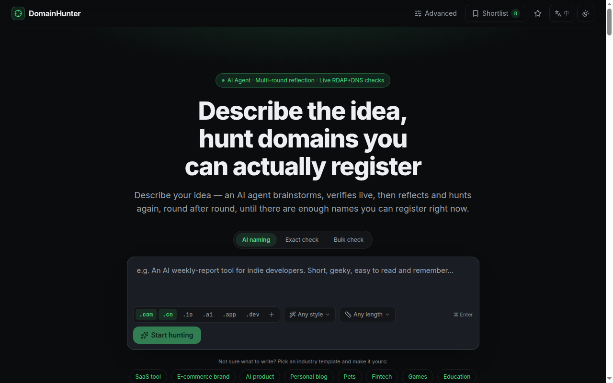
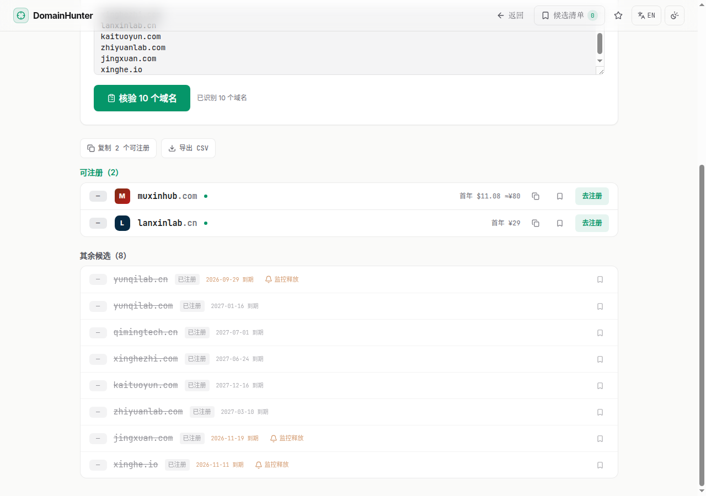
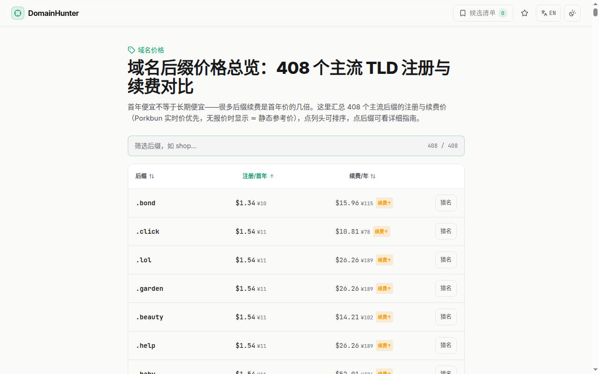
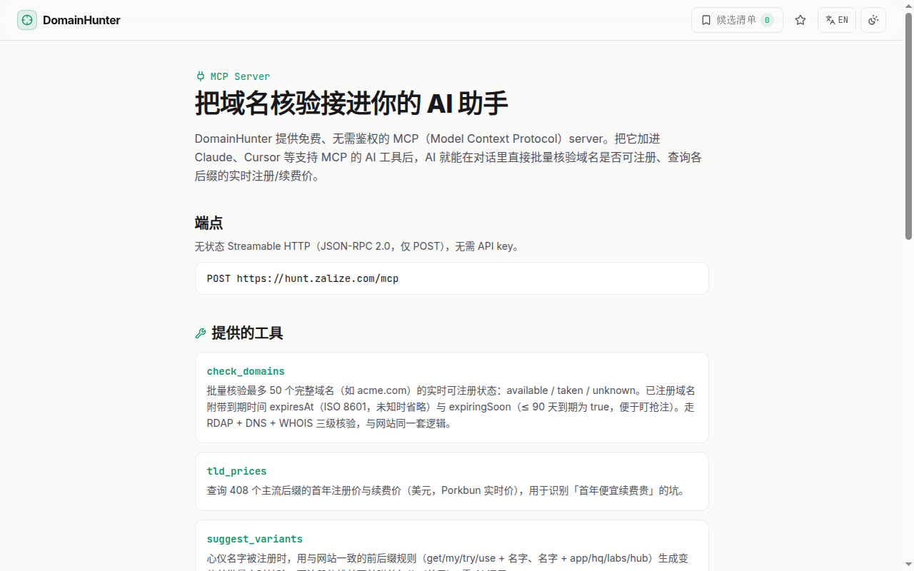
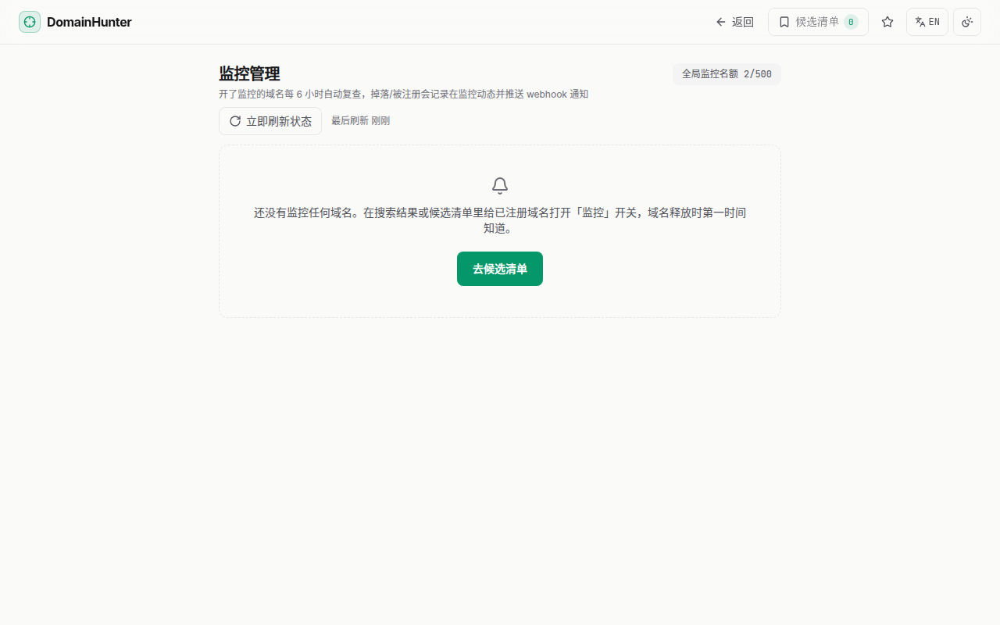
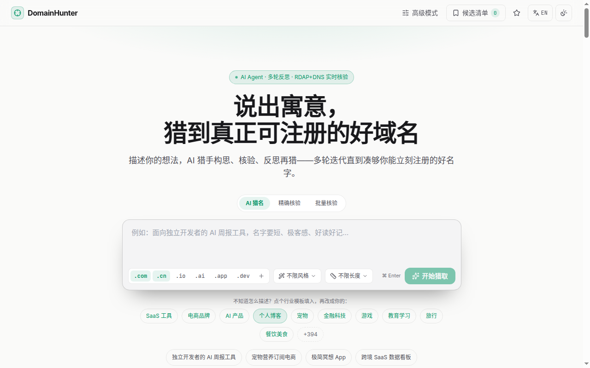
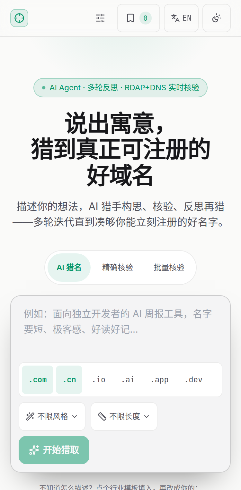
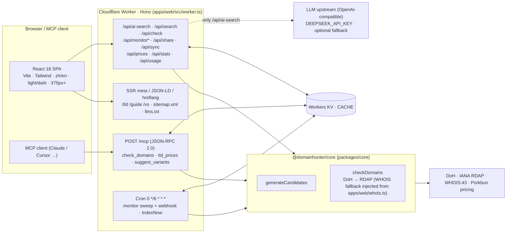

<div align="center">

# DomainHunter

**The domain hunter for Chinese founders: describe the meaning, get `.cn` / `.com` names that are actually registrable — right now.**

[Live: hunt.zalize.com](https://hunt.zalize.com?lang=en) · [中文 README](./README.md) · [MCP](https://hunt.zalize.com/mcp?lang=en) · [TLD prices](https://hunt.zalize.com/prices?lang=en)

[](./LICENSE)
[](https://workers.cloudflare.com/)
[](https://hono.dev/)
[](https://react.dev/)
[](https://www.typescriptlang.org/)
[](https://hunt.zalize.com/mcp?lang=en)
[](https://github.com/wookat/domainhunter/stargazers)



</div>

---

## What it is

Describe what you're building in one sentence — in Chinese or English — and an AI agent **proposes → verifies in real time → reflects and hunts again**, up to 5 rounds, returning only domains that are **actually registrable at this moment**, with expiry dates, first-year prices and registrar links.

It is tuned for Chinese founders and indie developers: candidates span **pinyin (full / abbreviated), fitting English words, coined words, and pinyin + English blends**, and verification covers `.cn` / `.com.cn` (CNNIC WHOIS) alongside `.com` and other mainstream TLDs. For generic English naming there are already great tools; we don't claim to beat them. **Chinese meaning → registrable domain** is the one thing this project focuses on.

Free, no login, open-core (MIT).

## Features

Everything below is live in production (routes: `apps/web/src/worker.ts`):

| Feature | Details | Where |
|---|---|---|
| **Multi-round AI agent** | Meaning → candidates (pinyin / word / coined / blend) → live check → cross-round dedup & reflection, up to 5 rounds, NDJSON stream; 20 req/h per IP | Home · `POST /api/ai-search` |
| **Real-time verification** | DoH prefilter → RDAP (IANA bootstrap) → WHOIS:43 fallback (`com/net/cn/com.cn/io/cc/tv/co/me/xyz/sh/gg/so/us`); results include `expiresAt` | all check paths |
| **Exact check / type-to-check** | Check a full domain instantly, no AI used | Home → "Exact check" |
| **Bulk paste + CSV export** | Up to 200 domains per run (newline/comma/space separated); bare names expand by TLD; copy available / export CSV | [/advanced](https://hunt.zalize.com/advanced?lang=en) · `POST /api/search` |
| **Expiry date + first-year price** | Taken domains show expiry; available ones show live Porkbun first-year price (static reference price `≈` for TLDs without a quote) | results · [/prices](https://hunt.zalize.com/prices?lang=en) · `GET /api/prices` |
| **Drop monitoring + webhook** | Watch a taken domain; cron rechecks every 6 h and POSTs status changes to your https webhook; manual recheck (60 s per IP) | [/monitors](https://hunt.zalize.com/monitors?lang=en) · `/api/monitor*` |
| **Shortlist + share / sync** | Local shortlist; read-only share page `/s/:id` (30 days, revocable); 8-char sync code for cross-device sync without login (90 days) | [/shortlist](https://hunt.zalize.com/shortlist?lang=en) · `/api/share` · `/api/sync` |
| **MCP endpoint** | `POST /mcp` (JSON-RPC 2.0, Streamable HTTP, protocol `2025-03-26`); tools: `check_domains` (≤50), `tld_prices`, `suggest_variants` | [/mcp](https://hunt.zalize.com/mcp?lang=en) |
| **400+ content pages** | TLD guides `/tld/:tld` (408), industry naming guides `/guide/:slug` (404), TLD comparisons `/vs/:slug` (444); bilingual, SSR meta / JSON-LD / hreflang, `sitemap.xml`, `llms.txt` | e.g. [/tld/cn](https://hunt.zalize.com/tld/cn?lang=en) |
| **Bilingual · dual theme · mobile** | zh/en dictionary (`apps/web/src/lib/i18n.tsx`), light/dark (≥4.5:1 contrast), responsive from 375 px, keyboard accessible | top-right toggles |

<details>
<summary><b>More screenshots</b> (real production, zero AI calls)</summary>

| Bulk check + CSV + expiry + monitor | TLD prices |
|---|---|
|  |  |

| MCP docs | Monitors |
|---|---|
|  |  |

| Chinese / light | 375 px mobile |
|---|---|
|  |  |

</details>

## Architecture



- **`packages/core`** — pure TypeScript engine (zero runtime deps): candidate generation + verification (DoH prefilter → IANA RDAP bootstrap); the WHOIS:43 fallback lives in `apps/web/src/whois.ts` (`cloudflare:sockets`) and is passed in as a callback.
- **`apps/web`** — Hono Worker (API, MCP, SSR, cron) + React 18 SPA served from the same Worker via the `ASSETS` binding.
- **KV `CACHE`** — check cache (taken 24 h / available 1 h), rate limits, monitor set, price cache, share/sync snapshots.
- **AI is used on exactly one path**: `/api/ai-search`. Exact check, bulk, MCP, monitoring and content pages make **zero AI calls**.

## Quick start

```bash
git clone https://github.com/wookat/domainhunter.git
cd domainhunter
pnpm install

pnpm dev                # wrangler dev (local Worker + SPA)
pnpm -r typecheck
pnpm --filter web test  # vitest
pnpm build              # vite build
```

Local AI hunting needs an LLM key: put `DEEPSEEK_API_KEY=...` in `apps/web/.dev.vars` (gitignored). Without it, everything except AI hunting still works.

## Self-host on Cloudflare

1. Log in and create the KV namespace:
   ```bash
   cd apps/web
   npx wrangler login
   npx wrangler kv namespace create CACHE
   ```
   Put the returned `id` into `kv_namespaces[0].id` in `apps/web/wrangler.jsonc` (and change `name` if you like).
2. Set secrets — **only via `wrangler secret put`, never in `wrangler.jsonc`**:

   | Secret / var | Required | Notes |
   |---|---|---|
   | `DEEPSEEK_API_KEY` | for AI hunting | LLM key (DeepSeek or any OpenAI-compatible gateway). Without it only AI hunting is disabled |
   | `LLM_API_BASE` | optional | OpenAI-compatible base URL, defaults to DeepSeek |
   | `LLM_MODEL` | optional | model name, defaults to `deepseek-chat` |
   | `LLM_THINKING` | optional | `disabled` turns off gateway-side reasoning (avoids 60 s timeouts) |
   | `LLM_FALLBACK_API_KEY` | optional | fallback upstream; on primary 401/402/403/5xx/quota-exhausted the request is retried once there |
   | `LLM_FALLBACK_API_BASE` / `LLM_FALLBACK_MODEL` / `LLM_FALLBACK_THINKING` | optional | fallback base / model / reasoning switch |

   ```bash
   npx wrangler secret put DEEPSEEK_API_KEY
   ```
3. Build and deploy:
   ```bash
   pnpm deploy             # = vite build && wrangler deploy
   ```
   The cron trigger (`0 */6 * * *`) and `ASSETS` binding are declared in `wrangler.jsonc`.
4. Optionally attach a custom domain in the Cloudflare dashboard.

## API at a glance

```bash
# bulk check (NDJSON stream)
curl -sN https://hunt.zalize.com/api/search \
  -H 'content-type: application/json' \
  -d '{"domains":["yunqilab.cn","muxinhub.com"]}'

# MCP: list tools
curl -s https://hunt.zalize.com/mcp \
  -H 'content-type: application/json' \
  -d '{"jsonrpc":"2.0","id":1,"method":"tools/list"}'
```

Full route list, KV key conventions and operational notes: [`docs/handoff-context.md`](./docs/handoff-context.md) (Chinese).

## Roadmap

Short iteration cycles (days, not quarters). Near-term:

- [ ] Keep tuning Chinese-meaning understanding and pinyin candidate quality against real founder prompts
- [ ] More Chinese registrar live pricing (`.cn` etc. currently use static reference prices; live prices come from Porkbun)
- [ ] More webhook/notification shapes for drop monitoring
- [ ] Publish `@domainhunter/core` to npm
- [ ] Keep the competitor comparison current ([`docs/research/`](./docs/research), [`docs/competitor-report.md`](./docs/competitor-report.md))

## Contributing

See [CONTRIBUTING.md](./CONTRIBUTING.md) (dev setup, branch/PR conventions, local acceptance commands, bilingual i18n + 375 px requirements, **zero-AI testing rule**), [SECURITY.md](./SECURITY.md) and [CODE_OF_CONDUCT.md](./CODE_OF_CONDUCT.md).

## License

[MIT](./LICENSE) © wookat
