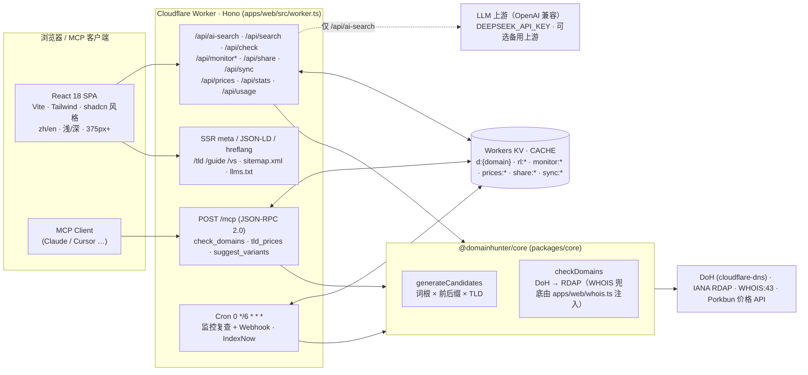

<div align="center">

# DomainHunter

**中文创业者的域名猎手：说出寓意，猎到真正可注册的 .cn/.com**

[在线使用 hunt.zalize.com](https://hunt.zalize.com) · [English](./README.en.md) · [MCP 接入](https://hunt.zalize.com/mcp) · [价格总览](https://hunt.zalize.com/prices)

[](./LICENSE)
[](https://workers.cloudflare.com/)
[](https://hono.dev/)
[](https://react.dev/)
[](https://www.typescriptlang.org/)
[](https://pnpm.io/)
[](https://hunt.zalize.com/mcp)
[](https://github.com/wookat/domainhunter/stargazers)


</div>

---

## 这是什么

你用一句中文描述想做的事——「面向独立开发者的 AI 周报工具，名字要短、极客感」——DomainHunter 的 AI Agent 会**构思 → 实时核验 → 反思再猎**，多轮迭代（最多 5 轮），最终只把**此刻真的能注册**的域名交给你，附到期日、首年价格与一键去注册链接。

它为中文创业者 / 独立开发者优化：候选同时覆盖**拼音（全拼/缩写）、贴切的英文单词、英文造词、拼音+英文混搭**四条命名路线，核验通道覆盖 `.cn` / `.com.cn`（CNNIC WHOIS）与 `.com` 等主流后缀。英文通用场景已有很好的工具，我们不在英文侧声称全面领先——**中文寓意 → 可注册域名**这条链路，是我们唯一专注的事。

免费、免登录、open-core（MIT）。

## 功能清单

以下全部为**已上线并可在生产验证**的功能（路由以 `apps/web/src/worker.ts` 为准）：

| 功能 | 说明 | 入口 |
|---|---|---|
| **AI Agent 多轮猎名** | 自然语言寓意 → 候选（pinyin / word / coined / blend 四路）→ 实时核验 → 跨轮去重反思，最多 5 轮，NDJSON 流式返回；每 IP 20 次/小时 | 首页 · `POST /api/ai-search` |
| **实时核验** | DoH 预筛 → RDAP（IANA bootstrap）→ WHOIS 43 端口兜底（`com/net/cn/com.cn/io/cc/tv/co/me/xyz/sh/gg/so/us`）；结果带 `expiresAt` | 全部核验路径 |
| **精确核验 / 即输即查** | 输入完整域名直接查，不消耗 AI | 首页「精确核验」 |
| **批量粘贴核验 + CSV 导出** | 一次 ≤200 个域名（换行/逗号/空格分隔），不带后缀按 TLD 展开；一键复制可注册、导出 CSV | [/advanced](https://hunt.zalize.com/advanced) · `POST /api/search` |
| **到期日 + 首年价格** | 已注册域名显示到期日期；可注册域名显示 Porkbun 实时首年价（无报价 TLD 用静态参考价 `≈`） | 结果列表 · [/prices](https://hunt.zalize.com/prices) · `GET /api/prices` |
| **监控释放 + Webhook** | 对已注册域名点「监控释放」，Cron 每 6 小时全量复查，状态变化推送到你配置的 https Webhook；支持手动实时复查（每 IP 60s） | [/monitors](https://hunt.zalize.com/monitors) · `/api/monitor*` |
| **候选清单 + 分享 / 跨设备同步** | 本地收藏清单；生成只读分享页 `/s/:id`（30 天，可撤销）；8 位同步码免登录跨设备同步（90 天） | [/shortlist](https://hunt.zalize.com/shortlist) · `/api/share` · `/api/sync` |
| **MCP 端点** | `POST /mcp`（JSON-RPC 2.0，Streamable HTTP，协议版 2025-03-26），工具：`check_domains`（≤50）、`tld_prices`、`suggest_variants` | [/mcp](https://hunt.zalize.com/mcp) |
| **400+ 内容页** | TLD 指南 `/tld/:tld`（408）、行业命名指南 `/guide/:slug`（404）、TLD 对比 `/vs/:slug`（444），全部双语 + SSR meta/JSON-LD/hreflang + `sitemap.xml` + `llms.txt` | [/tld/cn](https://hunt.zalize.com/tld/cn) 等 |
| **双语 · 双主题 · 移动端** | zh/en 全量词典（`apps/web/src/lib/i18n.tsx`）、浅色/深色（对比度 ≥4.5:1 为硬指标）、375px 起响应式、键盘可达 | 右上角切换 |

<details>
<summary><b>更多截图</b>（均为生产环境真实截图，零 AI 调用）</summary>

| 批量核验 + CSV + 到期日 + 监控 | 价格总览 |
|---|---|
|  |  |

| MCP 接入文档 | 监控管理 |
|---|---|
|  |  |

| 英文 / 深色 | 375px 移动端 |
|---|---|
|  |  |

</details>

## 架构



- **`packages/core`** — 纯 TypeScript 引擎（零运行时依赖）：候选生成 + 核验（DoH 预筛 → IANA RDAP bootstrap）；WHOIS 43 端口兜底在 `apps/web/src/whois.ts`（用 `cloudflare:sockets`）作为回调注入。
- **`apps/web`** — Hono Worker（API、MCP、SSR、Cron）+ React 18 SPA，同一个 Worker 同时服务 API 与静态资源（`ASSETS` binding）。
- **KV `CACHE`** — 核验缓存（taken 24h / available 1h 防抢注误导）、限流、监控集合、价格缓存、分享/同步快照。
- **AI 只在一条路径上**：`/api/ai-search`。其余全部功能（精确核验、批量、MCP、监控、内容页）均**零 AI 调用**。

## 快速开始

```bash
git clone https://github.com/wookat/domainhunter.git
cd domainhunter
pnpm install            # pnpm monorepo：packages/core + apps/web

pnpm dev                # = pnpm --filter web dev（wrangler dev，本地 Worker + SPA）
pnpm -r typecheck       # 全仓类型检查
pnpm --filter web test  # vitest
pnpm build              # = vite build
```

本地 AI 猎名需要一个 LLM key：在 `apps/web/.dev.vars`（已 gitignore）写入 `DEEPSEEK_API_KEY=...`。**不配置也能跑**——精确核验 / 批量 / MCP / 内容页全部可用。

## 自部署到 Cloudflare

1. 登录 Wrangler 并创建 KV：
   ```bash
   cd apps/web
   npx wrangler login
   npx wrangler kv namespace create CACHE
   ```
   把输出的 `id` 填到 `apps/web/wrangler.jsonc` 的 `kv_namespaces[0].id`，并按需改 `name`。
2. 写入 secrets（**只走 `wrangler secret put`，任何 key 都不要写进 `wrangler.jsonc`**）：

   | Secret / 变量 | 必需 | 说明 |
   |---|---|---|
   | `DEEPSEEK_API_KEY` | AI 猎名必需 | LLM 上游 key（DeepSeek 或任一 OpenAI 兼容网关）。未配置时仅 AI 功能不可用 |
   | `LLM_API_BASE` | 可选 | OpenAI 兼容 base URL，默认 DeepSeek |
   | `LLM_MODEL` | 可选 | 模型名，默认 `deepseek-chat` |
   | `LLM_THINKING` | 可选 | 设为 `disabled` 关闭网关侧思考链（避免 60s 超时） |
   | `LLM_FALLBACK_API_KEY` | 可选 | 备用上游 key；配置后主上游 401/402/403/5xx/额度耗尽时自动切换 1 次 |
   | `LLM_FALLBACK_API_BASE` / `LLM_FALLBACK_MODEL` / `LLM_FALLBACK_THINKING` | 可选 | 备用上游的 base / 模型 / 思考链开关 |

   ```bash
   npx wrangler secret put DEEPSEEK_API_KEY
   # 可选：
   npx wrangler secret put LLM_API_BASE
   npx wrangler secret put LLM_MODEL
   npx wrangler secret put LLM_FALLBACK_API_KEY
   ```
3. 构建并部署：
   ```bash
   pnpm deploy             # = vite build && wrangler deploy
   ```
   Cron `0 */6 * * *`（监控复查 + IndexNow）与 `ASSETS` binding 已在 `wrangler.jsonc` 中声明，部署即生效。
4. （可选）在 Cloudflare 控制台给 Worker 绑定自定义域。

## API 速览

```bash
# 批量核验（NDJSON 流）
curl -sN https://hunt.zalize.com/api/search \
  -H 'content-type: application/json' \
  -d '{"domains":["yunqilab.cn","muxinhub.com"]}'

# 清单复查（≤100，refresh 穿透缓存）
curl -sN https://hunt.zalize.com/api/check \
  -H 'content-type: application/json' \
  -d '{"domains":["lanxinlab.cn"],"refresh":true}'

# MCP：列出工具
curl -s https://hunt.zalize.com/mcp \
  -H 'content-type: application/json' \
  -d '{"jsonrpc":"2.0","id":1,"method":"tools/list"}'
```

完整路由、KV key 约定与运行细节见 [`docs/handoff-context.md`](./docs/handoff-context.md)。

## 路线图

短周期迭代（以天为单位），不做长期大计划。近期方向：

- [ ] 中文寓意理解与拼音候选质量的持续调优（对照真实中文创业者输入）
- [ ] 更多中国注册商实时报价（当前可注册价格来自 Porkbun，`.cn` 等为静态参考价）
- [ ] 监控 Webhook 的更多通知形态（当前为通用 https POST）
- [ ] `@domainhunter/core` 独立发布到 npm
- [ ] 竞品横评的持续更新（见 [`docs/research/`](./docs/research) 与 [`docs/competitor-report.md`](./docs/competitor-report.md)）

欢迎在 [Issues](https://github.com/wookat/domainhunter/issues) 提出你的需求。

## 贡献

- 阅读 [CONTRIBUTING.md](./CONTRIBUTING.md)：开发环境、分支/PR 约定、本地验收命令（`pnpm -r typecheck` / `pnpm --filter web test` / `pnpm --filter web build`）、双语 i18n 与 375px 硬指标、**零 AI 调用**测试纪律。
- 安全问题请走 [SECURITY.md](./SECURITY.md)（GitHub Security Advisories），不要开公开 Issue。
- 行为准则：[CODE_OF_CONDUCT.md](./CODE_OF_CONDUCT.md)（Contributor Covenant 2.1）。
- Bug / 需求模板：[新建 Issue](https://github.com/wookat/domainhunter/issues/new/choose)。

## License

[MIT](./LICENSE) © wookat
