# DomainHunter R2 生产站 QA 测试报告（https://hunt.zalize.com）

> 角色：qa-engineer ｜ 测试日期：2026-08-05 ｜ 结论：**无 P0；1 个 P1、3 个 P2**；「可注册」误报率 0%（32/32 复核），全部结果 0 条「未知」。

- 测试对象：线上生产站 https://hunt.zalize.com（Hono on Cloudflare Workers + React/Tailwind）
- 测试方式：真实环境黑盒走查，桌面（最大化 Chrome）+ 移动端 375px 视口（DevTools device toolbar），慢网络用 DevTools "Low-end mobile"（≈Slow 3G + CPU 节流）；「可注册」正确性用 rdap.org 与 whois 独立复核
- 录屏与截图：录屏见 PR 评论附件；截图见本目录 `screenshots-r2/`

## 一、用例 × 结果矩阵

| # | 用例 | 输入/操作 | 期望 | 实际 | 结果 |
|---|------|-----------|------|------|------|
| A1 | AI 模式中文描述 | 「面向宠物主人的智能喂食器品牌…」 tld=com,cn | 流式渐显、done 提示、可注册置顶 | 32 个可注册置顶，checking→最终态渐显，done 提示正确 | ✅ 通过 |
| A2 | AI 模式英文描述 | "AI coding assistant for indie hackers…" | 同上 | 13 个可注册，正常 | ✅ 通过 |
| A3a | 超长描述 320 字 | 中文 320 字符 | 正常执行（<500 上限） | 正常，11 个可注册 | ✅ 通过 |
| A3b | 超长描述 528 字 | 中文 528 字符 | 友好提示超长 | 仅显示裸「请求失败（400）」，未说明 500 字上限 | ⚠️ 通过但提示不友好（Bug P2-1） |
| A4a | 空输入 | 清空描述 | 主按钮 disabled | 「AI 帮我找」置灰不可点 | ✅ 通过 |
| A4b | 空输入 + 再来一批 | 清空描述后点「不满意，再来一批」 | 按钮应隐藏/禁用或友好提示 | 按钮仍可点，返回裸「请求失败（400）」 | ❌ Bug P2-2 |
| A5 | 注入/emoji | ` ' OR 1=1 -- 🚀🐶 找个域名` | 无 XSS、无崩溃 | 无弹窗，文本安全转义，AI 按 🚀🐶 语义出「火箭狗」域名 | ✅ 通过 |
| A6 | TLD 各种写法 | `.COM，.net`（前导点+大写+中文逗号） | 归一化为 .com/.net | 结果域名均为 .com/.net，无 `..com` | ✅ 通过 |
| B1/B2 | 高级模式多词根+后缀 | roots=tizhi,gwy suffixes=job,jobs tld=.COM，.net | 组合域名生成并核验 | tizhijob.com/gwyjobs.net 等 12 条，7 可注册置顶 | ✅ 通过 |
| B3 | 高级模式空词根 | roots 为空 | 按钮 disabled | 「开始检索」置灰 | ✅ 通过 |
| C1a | 再来一批 第 2 次 | 连续点击 | 不重复旧 label | 新增 38 个，与第 1 批 0 重复（excludeLabels 生效） | ✅ 通过 |
| C1b | 再来一批 第 3 次 | 再点一次 | 继续出新批次 | 「AI 服务出错，已停止本轮」+「已尽力检索（0 个可注册）」，0 新结果 | ❌ Bug P1-1 |
| C2 | 并发/中途操作 | AI 搜索进行中切到高级模式点「开始检索」 | 不混流、不报错 | 运行中所有搜索按钮 disabled，「再来一批」隐藏，无混流 | ✅ 通过（附 P2-3 备注） |
| D1 | 可注册误报率 | 32 个「可注册」样本（.com/.net/.cn）RDAP+whois 复核 | 误报率 0% | 32/32 确认未注册，误报率 **0%** | ✅ 通过 |
| D2 | unknown 占比 | 统计全部 5 轮搜索结果 | 越少越好 | **0 条「未知」**（含全部 .cn 结果，均给出可注册/已注册明确状态） | ✅ 通过 |
| E1 | 移动端 375px | iPhone 宽度走完整 AI 搜索 | 无溢出/遮挡 | 布局单列、按钮全宽，无横向溢出 | ✅ 通过 |
| E2 | 慢网络 | Low-end mobile（≈Slow 3G）节流下搜索 | 进行中反馈清晰、渐显 | 「第 1 轮：…正在核验…」持续显示，「检测中」徽章逐个翻转，最终 done | ✅ 通过 |
| E3 | 排序 | 观察各轮结果 | available 置顶分组 | 「可注册（N）」始终在「其余候选」上方 | ✅ 通过 |
| F1 | 流中断/刷新 | 搜索进行中按 F5 | 恢复或清晰重置 | 页面干净重置为初始态，无报错；进度不可恢复（无提示，属已知设计） | ✅ 通过（备注） |
| F2 | AI 出错提示 | 由 C1b 自然触发 | 友好提示 | 显示「AI 服务出错，已停止本轮」，中文可懂但无重试引导 | ⚠️ 见 P1-1 |

## 二、Bug 清单（P0/P1/P2）

**P0：无**

### P1-1 「不满意，再来一批」第 3 次点击必现 AI 服务出错，0 新结果
- 复现：AI 模式任意描述搜索 → 点「再来一批」1 次成功 → 再点第 2 次（累计第 3 轮请求）
- 期望：继续产出新一批域名
- 实际：`AI 服务出错，已停止本轮` + `已尽力检索（0 个可注册）`，无任何新结果。疑似 excludeLabels 累积过大（>100 个）导致 DeepSeek prompt 超限/超时（worker.ts 将 excludeLabels 全量注入 prompt）
- 截图：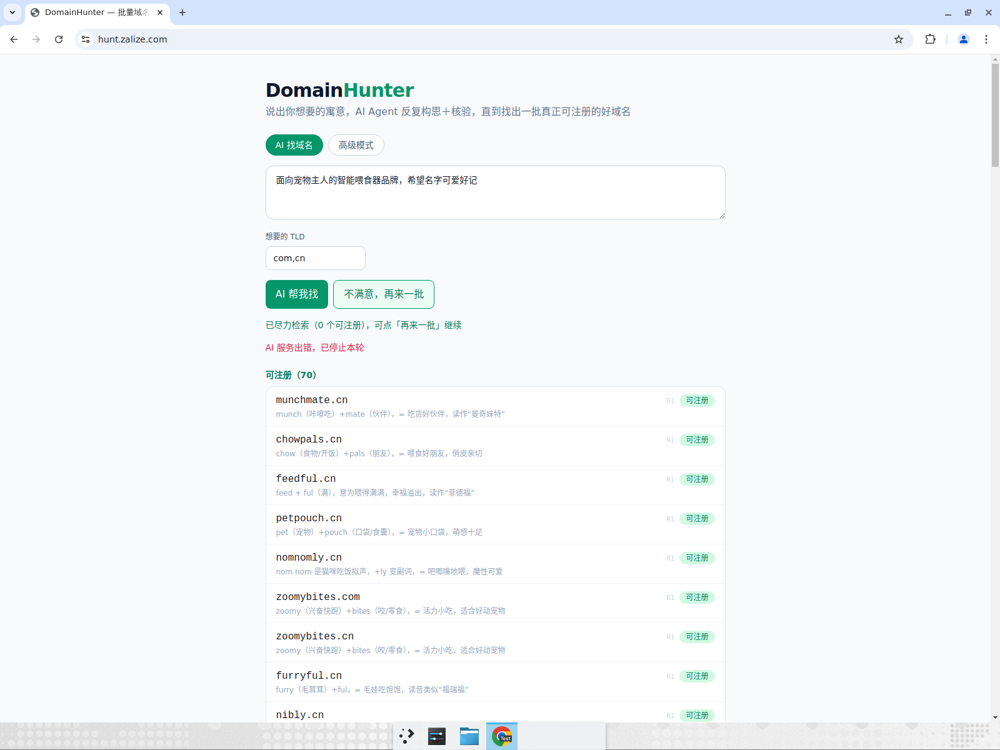

### P2-1 描述超过 500 字仅显示裸「请求失败（400）」
- 复现：输入 528 字描述 → 点「AI 帮我找」
- 期望：前端限长或提示「描述最长 500 字」
- 实际：红字「请求失败（400）」，用户不知原因
- 截图：

### P2-2 描述清空后「不满意，再来一批」仍可点击 → 400
- 复现：完成一次搜索 → 清空描述 →「AI 帮我找」正确置灰，但「不满意，再来一批」仍可点 → 裸 400 错误
- 期望：描述为空时该按钮同样禁用
- 截图：

### P2-3（体验备注）切换 Tab 后保留上一模式的结果 + 轮次徽章恒为 R1
- 高级模式页会显示 AI 模式的旧结果（含寓意文案），易混淆；「再来一批」的新批次徽章仍标 R1（每次请求轮次从 1 重新计数），无法区分批次
- 截图：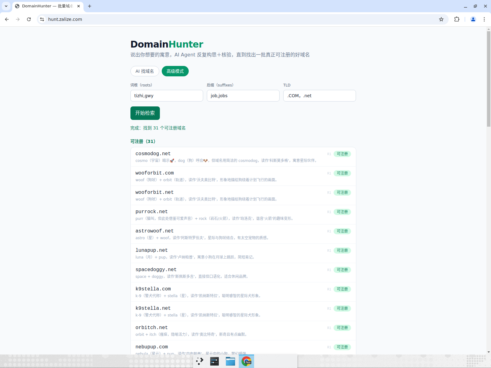

## 三、正确性统计
- 「可注册」独立复核样本 32 个（.com 13 / .net 9 / .cn 10，来自 4 轮不同搜索）：rdap.org 404 或 whois "No matching record" 全部确认未注册 → **误报率 0/32 = 0%**
- 「未知 unknown」占比：全部 5 轮共约 250+ 条结果中 **0 条未知**；.cn 未出现大量 unknown（.cn 无 IANA RDAP，站点仍给出明确状态且抽查 6 个 .cn 全部正确，说明线上对 .cn 有有效的检测通路）
- 校准说明：rdap.org 对 .cn 一律 404（baidu.cn 也 404），故 .cn 全部改用 whois 复核

## 四、关键截图

| 用例 | 截图 |
|---|---|
| A1 中文搜索结果（可注册置顶） | 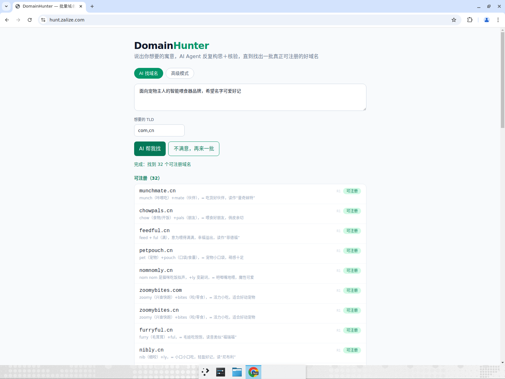 |
| A2 英文 + `.COM，.net` 归一化 | 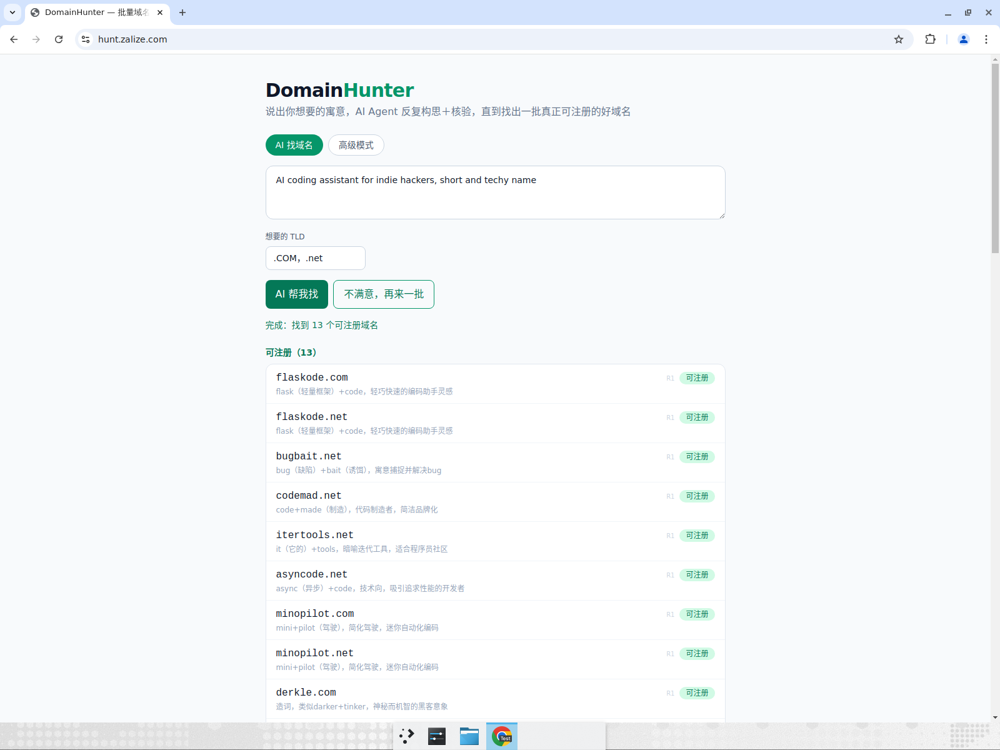 |
| A3 320 字长描述正常 | 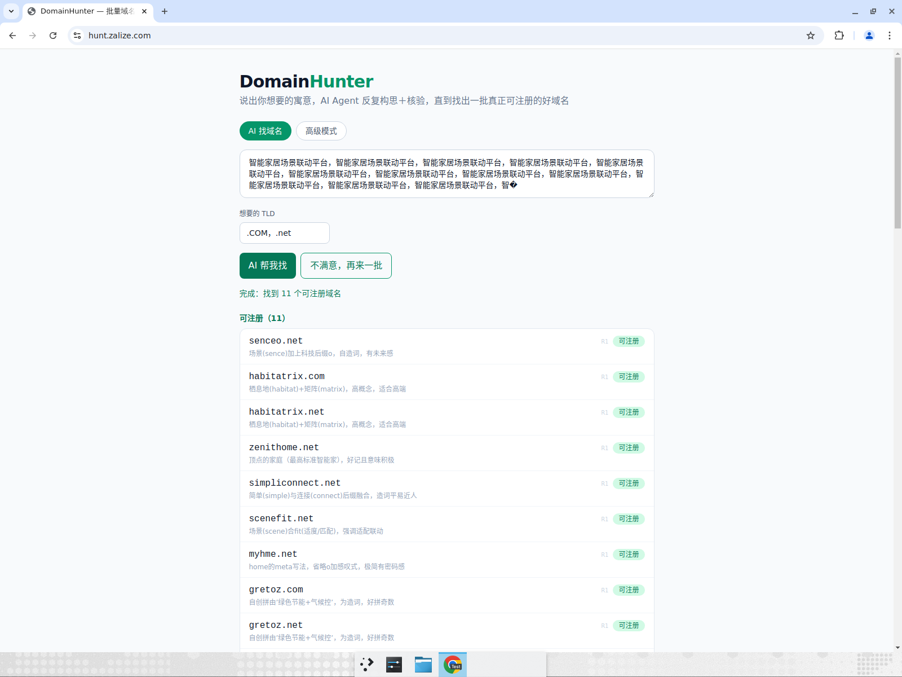 |
| A5 注入输入安全处理 | 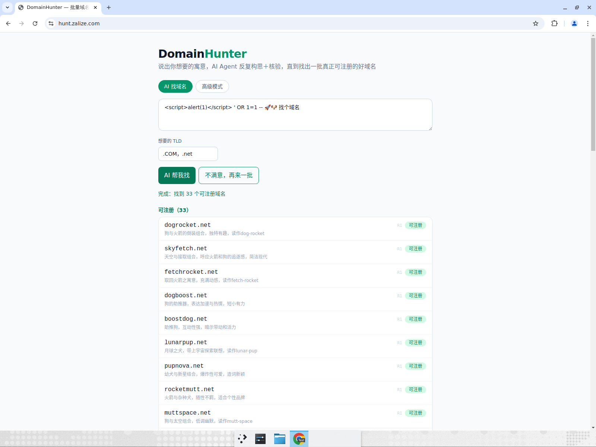 |
| B1/B2 高级模式组合检索 | 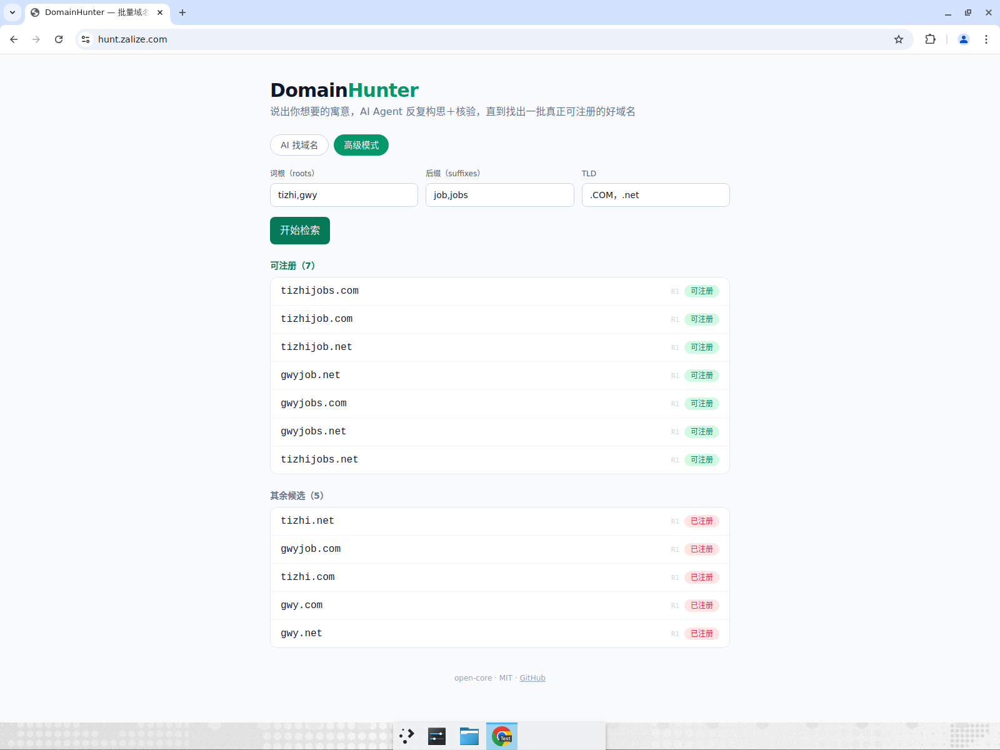 |
| C1 再来一批第 2 批（无重复） | 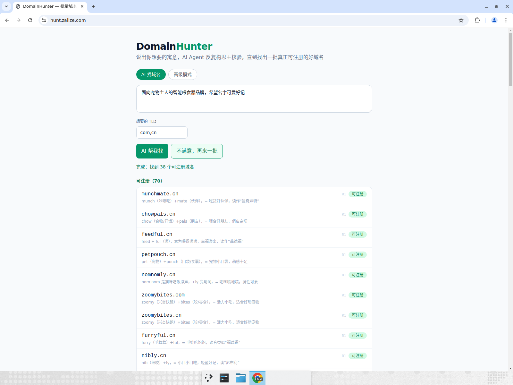 |
| E1/E2 375px + 慢网流式「检测中」 | 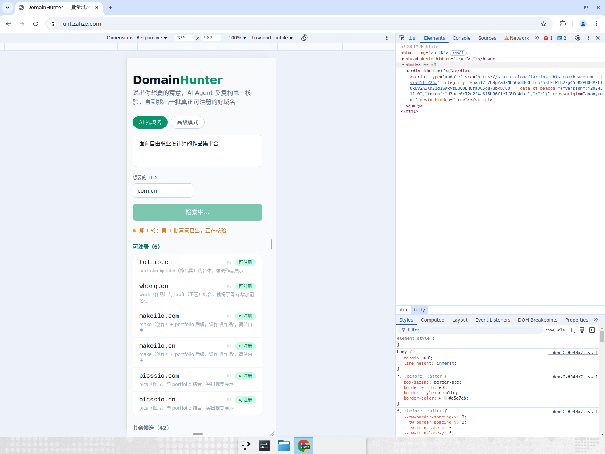 |
| E1 375px 完成态 | 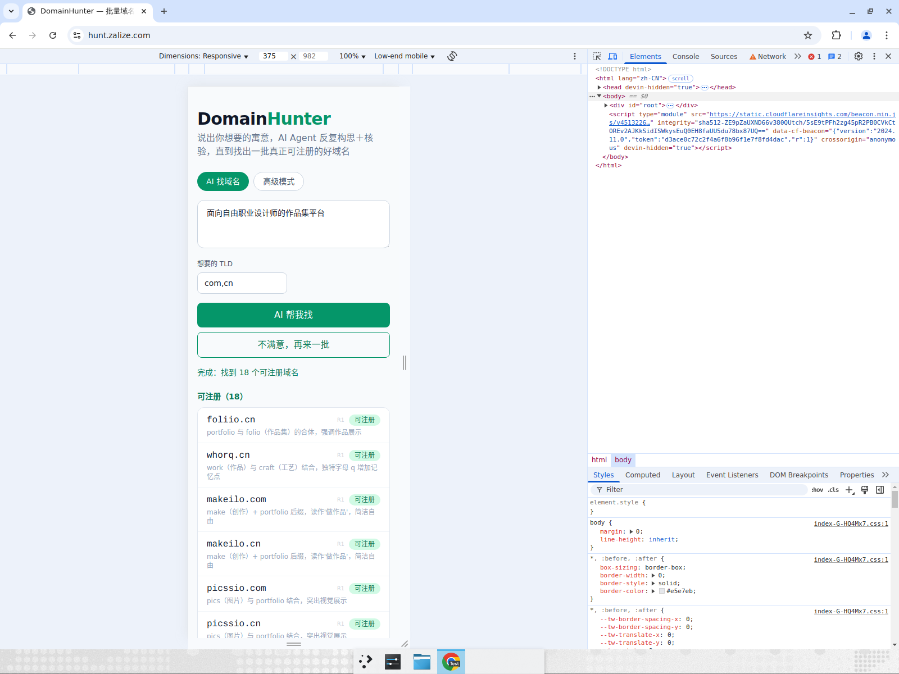 |
| F1 搜索中刷新后干净重置 | 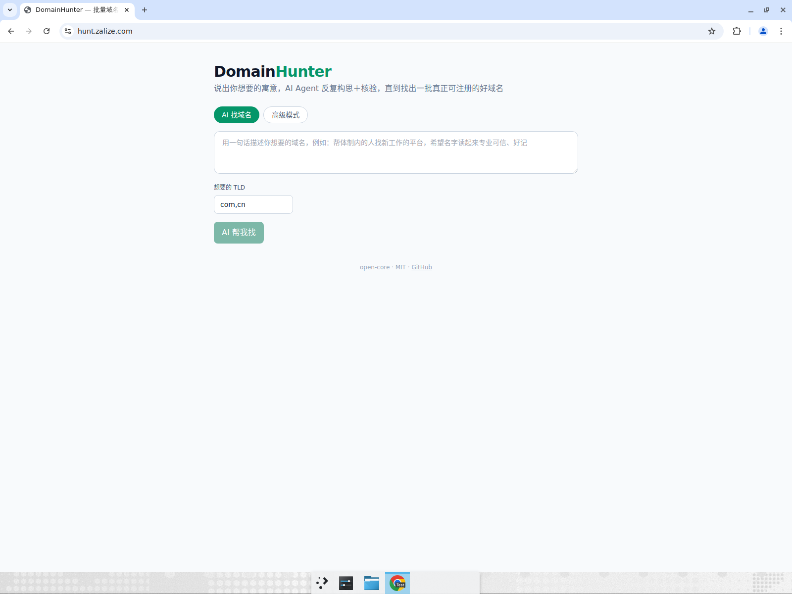 |
